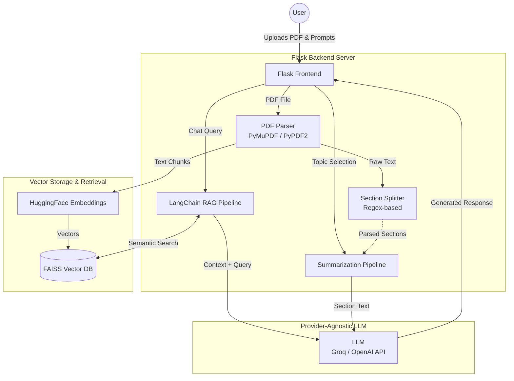

# ResearchMate — AI-Powered Research Paper Analyzer & RAG Chatbot


**ResearchMate** is a full-stack web application designed to accelerate academic and professional research. By leveraging advanced Retrieval-Augmented Generation (RAG) and Large Language Models (LLMs), it allows users to instantly parse, summarize, and interrogate dense research papers through an intuitive chat interface.

## ✨ Key Features

* **Provider-Agnostic LLM Architecture:** Designed with flexibility in mind. Users can bring their own API keys (e.g., Groq, OpenAI) to power summarization and chat, effectively decoupling the core logic from any single model vendor.
* **Intelligent Document Parsing:** Upload any research PDF and the pipeline automatically detects and extracts logical sections (Abstract, Methodology, Conclusion, etc.) using robust regex-based parsing.
* **On-Demand Summarization:** Generate concise, LLM-driven summaries for specific sections of the paper, allowing researchers to quickly grasp key concepts without reading the entire document.
* **Context-Aware Q&A Chatbot (RAG):** Ask complex questions about the paper. The RAG pipeline uses LangChain, HuggingFace embeddings, and FAISS vector search to ensure that all chatbot answers are strictly grounded in the document's actual content—preventing hallucinations.

## 🏗️ Architecture & Tech Stack

* **Backend:** Python, Flask
* **LLM Orchestration:** LangChain
* **Embeddings:** HuggingFace Embeddings (`sentence-transformers`)
* **Vector Database:** FAISS (Facebook AI Similarity Search)
* **Document Processing:** PyMuPDF (`fitz`), PyPDF2
* **Frontend:** HTML, CSS, JavaScript (via Flask Templates)

### System Architecture




## 🚀 Getting Started

### Prerequisites

* Python 3.8 or higher
* An API Key for your preferred LLM provider (e.g., Groq API Key)

### Installation

1. **Clone the repository:**
   ```bash
   git clone https://github.com/yourusername/ResearchMate.git
   cd ResearchMate
   ```

2. **Create a virtual environment (recommended):**
   ```bash
   python -m venv venv
   source venv/bin/activate  # On Windows use `venv\Scripts\activate`
   ```

3. **Install dependencies:**
   ```bash
   pip install -r requirements.txt
   ```

4. **Set up environment variables:**
   Create a `.env` file in the root directory and add your configuration.
   ```env
   GROQ_API_KEY=your_api_key_here
   LLM_MODEL=llama3-8b-8192  # Or your preferred model
   EMBEDDING_MODEL=all-MiniLM-L6-v2
   ```

### Running the Application

1. Start the Flask server:
   ```bash
   python app.py
   ```
2. Open your web browser and navigate to `http://127.0.0.1:5000/`.

## 💡 How It Works

1. **Upload:** The user uploads a PDF document via the web interface.
2. **Extraction & Chunking:** The backend parses the PDF text, splitting it into logical sections and overlapping chunks to preserve context.
3. **Embedding:** Text chunks are embedded using HuggingFace models and indexed in a local FAISS vector store.
4. **Interaction:**
   - **Summarize:** The user selects a section, and the LLM processes that specific text to return a summary.
   - **Chat:** The user asks a question, the system queries the FAISS index for relevant chunks, and the LLM synthesizes an accurate answer based *only* on the retrieved context.

## 🤝 Contributing
Contributions, issues, and feature requests are welcome! Feel free to check the [issues page](https://github.com/yourusername/ResearchMate/issues).

## 📝 License
This project is licensed under the MIT License.
